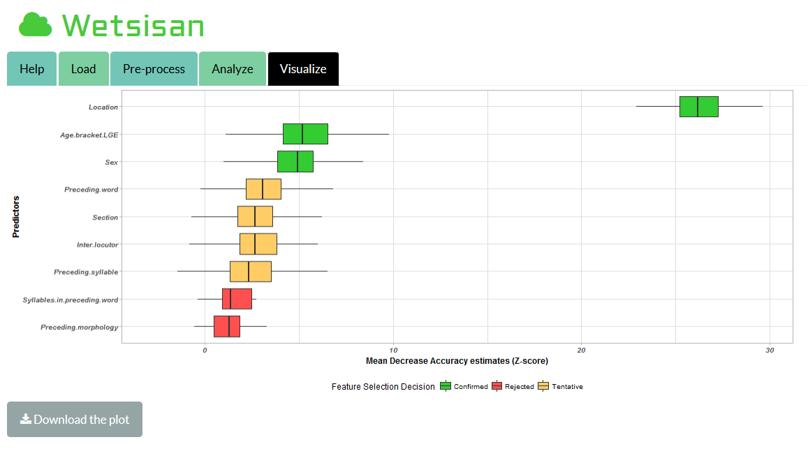

# wetsisan

## Overview

The purpose of Wetsisan is to provide a graphical interface to support the exploration of predictor importance in linguistic datasets.

It uses the convenient all-relevant feature selection algorithm [Boruta](https://cran.r-project.org/web/packages/Boruta/index.html) and [tidyverse](https://www.tidyverse.org/) with a random forest approach (for robustness).

Wetsisan is adapted for the processing of csv files, in which rows represent observations and columns represent predictors/tokens.

Wetsisan is the Australian Kriol word for monsoon. (the interface was first used to process the Kriol corpus collected by Dr. Greg Dickson at the [Centre of Excellence for the Dynamics of Language](www.dynamicsoflanguage.edu.au/))

## Installation

You can install wetsisan from github with:

``` r
# install.packages("devtools")
devtools::install_github("CoEDL/wetsisan")
```

## How to use

You can run the app with :

``` r
library(wetsisan)
run_wetsisan()
```

The navigation tabs at the top of the interface take you through the different steps of the pipeline.



### Loading panel

Loads the csv file, and displays its head

### Pre-process panel

Selects the column containing the token and all the predictors

### Analyze panel

Runs the Boruta algorithm to estimate the importance of each predictor and make a decision on their relevance

### Visualize panel

Displays a boxplot plot of the estimates of importance for all predictors over all the Boruta runs.


